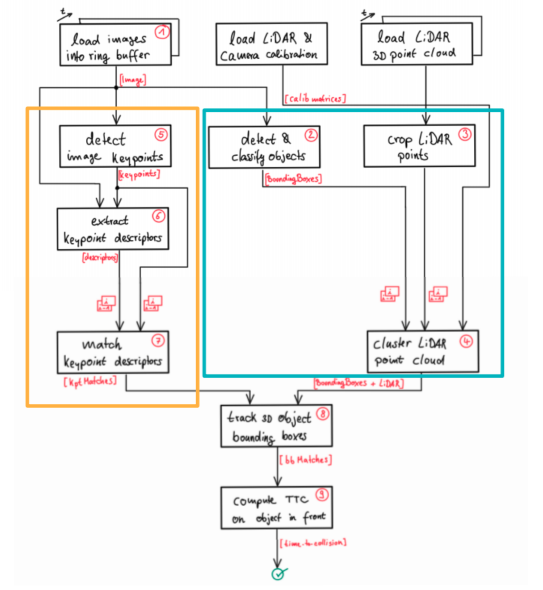
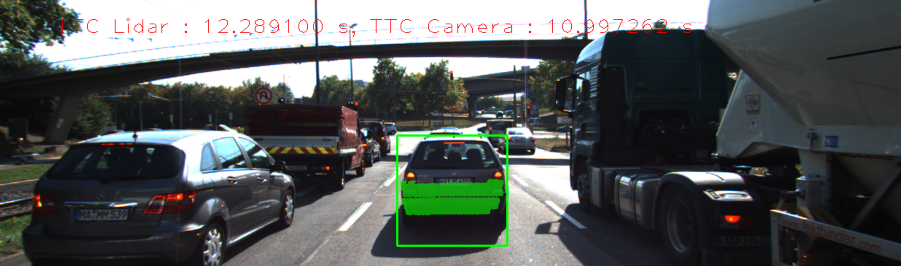
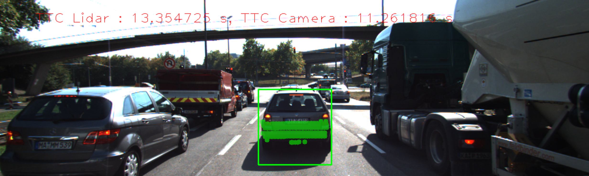
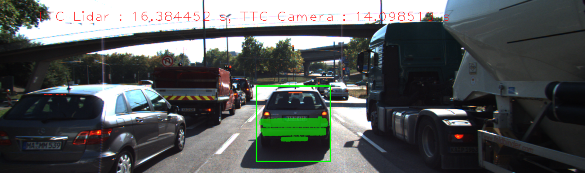
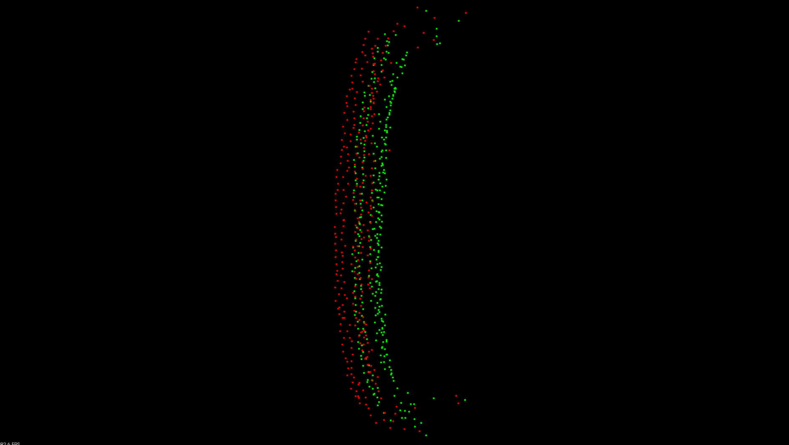
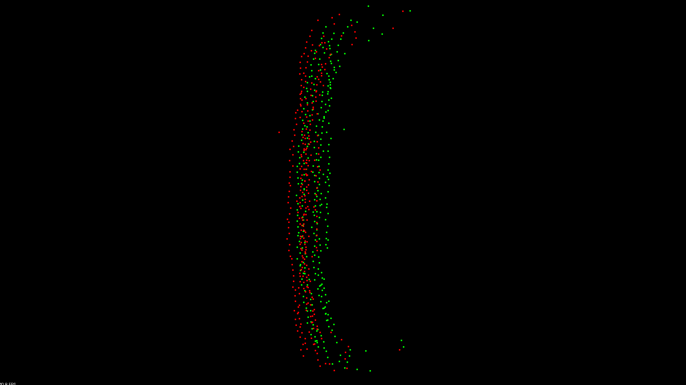

# 3D Object Tracking based on LiDAR and Sensor data

The aim of this project computes the time to collision based on the LiDAR and camera information. The method uses feature detector, descriptor, YOLO, and feature matching method.

## Dependencies for Running Locally
* cmake >= 2.8
  * All OSes: [click here for installation instructions](https://cmake.org/install/)
* make >= 4.1 (Linux, Mac), 3.81 (Windows)
  * Linux: make is installed by default on most Linux distros
  * Mac: [install Xcode command line tools to get make](https://developer.apple.com/xcode/features/)
  * Windows: [Click here for installation instructions](http://gnuwin32.sourceforge.net/packages/make.htm)
* Git LFS
  * Weight files are handled using [LFS](https://git-lfs.github.com/)
* OpenCV >= 4.1
  * This must be compiled from source using the `-D OPENCV_ENABLE_NONFREE=ON` cmake flag for testing the SIFT and SURF detectors.
  * The OpenCV 4.1.0 source code can be found [here](https://github.com/opencv/opencv/tree/4.1.0)
* gcc/g++ >= 5.4
  * Linux: gcc / g++ is installed by default on most Linux distros
  * Mac: same deal as make - [install Xcode command line tools](https://developer.apple.com/xcode/features/)
  * Windows: recommend using [MinGW](http://www.mingw.org/)

## Basic Build Instructions

1. Clone this repo.
2. Make a build directory in the top level project directory: `mkdir build && cd build`
3. Compile: `cmake .. && make`
4. Run it: `./3D_object_tracking`.

## Performance Evaluation 1
Find examples where the TTC estimate of the Lidar sensor does not seem plausible. Describe your observations and provide a sound argumentation why you think this happened.
The following three figures show that the third figure's TTC slightly increases compared to the previous two, first and second results. 

The reason is that collected LiDAR on the third data has more noisy compared to the previous. The following figures visually present two different point cloud. To resolve this one, 
it requires outlier detection and elimination instead of using the average or median values.

## Performance Evaluation 2
Run several detector / descriptor combinations and look at the differences in TTC estimation. Find out which methods perform best and also include several examples where camera-based TTC estimation is way off. As with Lidar, describe your observations again and also look into potential reasons.

Based on the previous comparison assessment (https://github.com/parang17/Sensor-Fusion-Feature-Tracking), I ranked three different combinations: FAST+BRIEF, FAST+ORB, ORB+BRIEF.
The result show that FAST+BRIEF is the best since standard deviation is smaller than others. The thrid case, one estimated TTC result is inf. Therefore, it cannot compute the mean and standard deviation.     
| Rank | Combination(detect + descriptor)   | Mean   | Standard deviation    |
| ---- | ---                                | ---    |  ---                  |
| 1    | FAST + BRIEF                       |12.9031 | 3.26456               |
| 2    | FAST + ORB                         |13.7737 | 4.49047               | 
| 3    | ORB + BRIEF                        | N/A    | N/A                   |     

